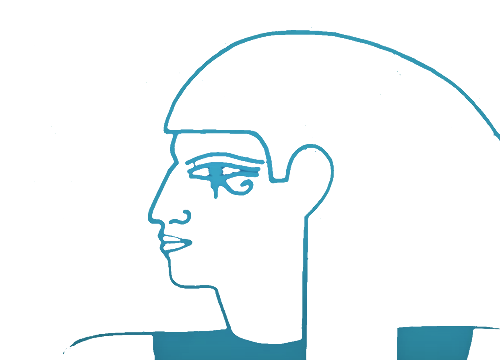

# Decent UCAN Play



## Overview

Decent UCAN Play is a futuristic, web-based application that leverages [web3.storage](https://web3.storage) and UCAN-based authentication to provide secure and persistent file storage and browsing on IPFS. Mostly just a another layer on top of the web3.storage API, it showcases how to build a user-friendly interface for managing uploads and exploring content in a decentralized manner.

## Features

- **Persistent Authentication:** Users authenticate via a unique agent credential that is securely stored in IndexedDB. New users undergo an email verification and UCAN authorization process, while returning users have their state automatically restored.

- **Spaces & Uploads:** Each user’s agent is associated with multiple Spaces (namespaces for uploads). The app lists all Spaces with human-readable names (if provided) and allows you to view each Space's uploads.

- **Embedded Directory Views:** Each upload entry displays a root CID formatted as a clickable link (using the `w3s.link` gateway). A dropdown button toggles an embedded iframe that displays the directory view of the uploaded content directly from IPFS.

- **Comprehensive Aggregation:** The application aggregates uploads across paginated API responses, so all results are loaded and displayed together without needing a separate "Load More" button.

- **Custom UI with Neon Effects:** Enjoy a distinctive, futuristic look with a custom CSS theme. The app features a Horus.png background, neon text, animations, and a dynamic neon round button that opens an educational modal.  Want your own style or want to add functionality? Fork the repo and make it your own!

- **Educational Modal:** A neon round button in the upper left (featuring a 📚 emoji) opens a modal in the center of the screen. The modal provides embedded YouTube videos and resource links to help you learn about IPFS and web3.storage.

## Local Installation

Ensure you have Node.js (v18+) and npm (v7+) installed. Then, clone this repository and install dependencies:

```bash
git clone https://github.com/yourusername/Decent_UCAN_Play.git
cd Decent_UCAN_Play
npm install
```

## Usage

To run the application locally, start a development server (using Vite):

```bash
npm run dev
```

The app typically runs at [http://localhost:5173](http://localhost:5173).

### Authentication & Persistence

- **New Users:** New users are prompted to login via email verification if no agent credentials exist. After email confirmation (and KYC and optional payment plan selection), the agent state is persisted locally.

- **Existing Users:** Returning users load their agent credentials from IndexedDB, and their associated Spaces and uploads are displayed.

## How It Works

1. **Client Initialization:**
   The client is initialized by calling `create()` from the w3up-client library, which loads persisted agent data from IndexedDB. Once authenticated, the app displays your agent’s DID and retrieves all associated Spaces.

2. **Space Listing:**
   Available Spaces are rendered as clickable entries. The app prioritizes human-readable names (if provided via metadata) over long DID keys. Clicking a Space sets it as the current context and fetches all its uploads.

3. **Upload Aggregation & Directory Embedding:**
   All uploads are fetched and sorted by their insertion timestamp. Each upload entry includes a clickable root CID and a dropdown button that toggles an embedded iframe displaying the directory view of the uploaded content from IPFS.

4. **Educational Modal:**
   A neon round button in the upper left (with a 📚 emoji) provides quick access to learning resources about IPFS. When clicked, a modal appears in the center of the screen containing embedded YouTube videos and helpful resource links. Future bounties to come! Check back frequently!

5. **Security & Privacy:**
   All sensitive agent credentials are securely stored in IndexedDB. No sensitive data is exposed in the repository or transmitted insecurely.

---

<footer>
  <hr>
  <p style="text-align: center;">
    
    
    
  </p>
</footer>

## License

This project is licensed under the [MIT License](LICENSE).